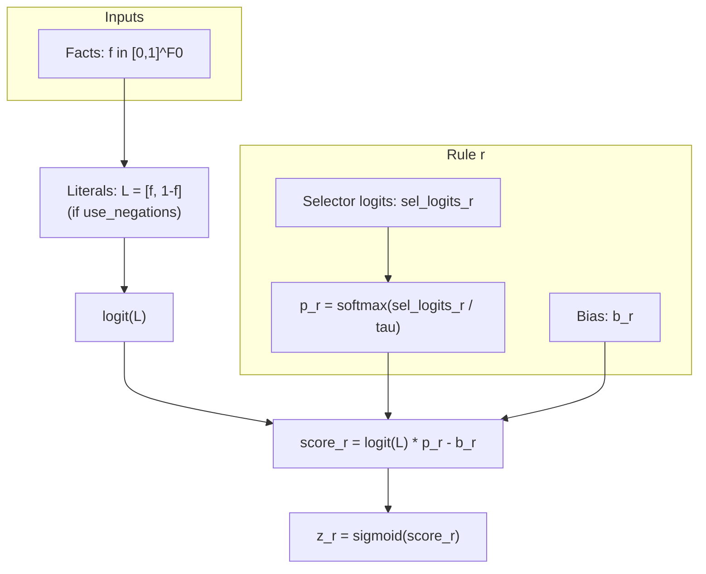

# Nous: A Neuro-Symbolic Library for Interpretable AI

[](https://pypi.org/project/nous/)
[](https://opensource.org/licenses/MIT)
[](https://www.python.org/)
[](https://pytorch.org/)

**Nous** (Greek: νοῦς, "mind") is a neuro-symbolic library for **interpretable learning** in PyTorch. It provides models whose predictions flow through **facts** and **rules**, with explanations that are *honest by construction*—derived from recomputing forward passes under controlled interventions, not post-hoc gradient approximations.

> **Design principle:** features → facts → rules → prediction  
> **Explanation method:** counterfactual forward evaluation

---

## Installation

```bash
pip install nous
```

Optional extras:

```bash
pip install "nous[examples]"
pip install "nous[dev]"
```

---

## Core Concepts

Nous models are composed of modular, interpretable components:

| Component | Description |
|-----------|-------------|
| **Facts** | Differentiable feature transforms (threshold facts, β-facts) mapping inputs to [0,1] |
| **Rules** | Soft logical compositions (AND/OR/k-of-n/NOT) with learnable selection |
| **Gating** | Sparse rule activation via hard top-k or differentiable gates |
| **Heads** | Linear or prototype-based prediction layers |

**Honest explanations** are grounded in the model's computation:
- Drop a rule → recompute → measure prediction change
- Freeze active rules → recompute → measure sufficiency
- Prune activations → recompute → measure fidelity

---

## Quick Start

**SoftLogitAND** is the recommended model for tabular tasks—balancing accuracy, stability, and interpretability.

```python
import torch
import torch.nn as nn
from sklearn.model_selection import train_test_split
from sklearn.preprocessing import StandardScaler
from torch.utils.data import DataLoader, TensorDataset

from nous import SoftLogitAND
from nous.training import train_model

device = torch.device("cuda" if torch.cuda.is_available() else "cpu")

# Prepare data (SoftLogitAND expects scaled inputs)
scaler = StandardScaler().fit(X_train)
X_train_scaled = scaler.transform(X_train).astype("float32")
X_val_scaled   = scaler.transform(X_val).astype("float32")

# Initialize model
model = SoftLogitAND(
    input_dim=X_train_scaled.shape[1],
    n_rules=256,
    n_thresh_per_feat=4,
    tau=0.7,
    use_negations=True,
)
model.init_from_data(X_train_scaled)  # thresholds from empirical quantiles
model.to(device)

# Loaders
train_loader = DataLoader(
    TensorDataset(
        torch.tensor(X_train_scaled),
        torch.tensor(y_train, dtype=torch.float32),
    ),
    batch_size=512,
    shuffle=True,
    drop_last=False,
)
val_loader = DataLoader(
    TensorDataset(
        torch.tensor(X_val_scaled),
        torch.tensor(y_val, dtype=torch.float32),
    ),
    batch_size=512,
    shuffle=False,
    drop_last=False,
)

# Train
best_val = train_model(
    model=model,
    train_loader=train_loader,
    val_loader=val_loader,
    criterion=nn.BCEWithLogitsLoss(),
    optimizer=torch.optim.AdamW(model.parameters(), lr=2e-3, weight_decay=1e-4),
    epochs=300,
    patience=30,
    device=device,
    clip_grad_max_norm=1.0,
    zero_grad_set_to_none=True,
    loss_average="sample",
    print_l0=False,
)
print("best val loss:", best_val)
```

---

### SoftLogitAND (single-rule computation)



---

## Explanation API

### Local explanations with cluster themes (SoftLogitAND)

```python
from nous import SoftLogitANDPosthocExplainer

explainer = SoftLogitANDPosthocExplainer(
    model=model,
    feature_names=feature_names,
    x_scaler=scaler,   # required if you pass raw (unscaled) x to report()
    k_rules=10,
    n_clusters=16,
)

explainer.fit_posthoc(X_ref_scaled=X_train_scaled)

report = explainer.report(x_raw, y_true01=float(y_true), x_is_scaled=False)
print(report.markdown)                  # Human-readable explanation
df = report.tables["cluster_themes"]    # Structured rule clusters (DataFrame)
```

### Intervention-based analysis (NousNet)

```python
from nous import rule_impact_df, minimal_sufficient_explanation, suggest_rule_counterfactuals

impacts = rule_impact_df(model, x, feature_names)
mse = minimal_sufficient_explanation(model, x, feature_names)
cfs = suggest_rule_counterfactuals(model, x, feature_names, target="flip")
```

---

## Model Zoo

| Model | Description |
|-------|-------------|
| **SoftLogitAND** | Threshold facts + logit-AND rules (recommended baseline) |
| **SoftLogicInteraction** | Low-rank interaction facts before logit-AND rules |
| **SegmentMoE** | Mixture-of-experts with soft-logic gating |
| **HierarchicalMoE** | SegmentMoE gating with SoftLogitAND experts |
| **NousFamilies** | Rule aggregation into stable families for governance |

---

## Export (NousNet → NumPy)

Export is currently implemented for **`NousNet`** models (including `soft_fact` layers and rule gaters), producing a self-contained NumPy inference module and validating parity vs PyTorch.

```python
import numpy as np
from nous import NousNet
from nous.export import export_numpy_inference, load_numpy_module, validate_numpy_vs_torch

model = NousNet(
    input_dim=8,
    num_outputs=3,
    task_type="classification",
    num_facts=12,
    rules_per_layer=(8,),
    rule_selection_method="soft_fact",
    use_calibrators=False,
)

X = np.random.randn(64, 8).astype(np.float32)

export_numpy_inference(model, file_path="infer.py")
npmod = load_numpy_module("infer.py")

report = validate_numpy_vs_torch(model, npmod, X, task="classification", n=32)
print(report)
```

---

## Example Results (synthetic + sanity checks)

Nous does not yet ship a full benchmark suite. For transparency, we report an illustrative experiment from
`examples/softlogit_synthetic.py`: a controlled synthetic binary classification task with **hidden ground‑truth rules**
and **correlated decoy features** (to stress interpretability).

### Predictive metrics (vs common baselines)

Below is a representative run comparing SoftLogitAND against strong baselines (EBM and XGBoost).
This is *not* a general benchmark claim; it is provided as an internal validation and demonstration of the workflow.

| model        | split | auc      | acc      | logloss   |
|-------------|-------|----------|----------|-----------|
| EBM         | test  | 0.678388 | 0.621167 | 0.627355  |
| XGBoost     | test  | 0.674476 | 0.628000 | 0.625940  |
| SoftLogitAND| test  | 0.673156 | 0.630167 | 0.628430  |
| XGBoost     | train | 0.837673 | 0.750381 | 0.565467  |
| EBM         | train | 0.750905 | 0.683286 | 0.590412  |
| SoftLogitAND| train | 0.708272 | 0.649571 | 0.608605  |
| SoftLogitAND| val   | 0.693072 | 0.648667 | 0.617313  |
| EBM         | val   | 0.692212 | 0.639667 | 0.621746  |
| XGBoost     | val   | 0.689324 | 0.644333 | 0.620255  |

**Interpretation.** On this task, SoftLogitAND is competitive with strong baselines on test performance while providing
a strictly rule‑based structure and direct intervention-based explanations. For this reason, SoftLogitAND is the
recommended default model in Nous when you want a strong accuracy/interpretability trade-off.

### Logic sanity check: ground-truth rules firing for a sample

Since the dataset is generated by known rules, we can verify which ground‑truth rules are satisfied for any input `x`.
Example output for one sample:

| truth_rule | weight | conds |
|---|---|---|
| R1_pos | 2.4 | [(3, '>', 0.7), (17, '<=', -0.2)] |
| R2_pos | 2.0 | [(55, '>', 0.0), (120, '<=', 0.0), (7, '>', 0.0)] |
| R3_neg | -2.0 | [(10, '<=', -1.2), (11, '<=', -0.8)] |
| R4_pos | 1.2 | [(80, '>', 0.3), (81, '>', 0.3)] |

This check is useful when interpreting local rule explanations: it clarifies whether the underlying “true” mechanism is active.

### Feature recovery @K (global importance vs ground truth)

Because the generating rules depend on a small set of true features, we can measure how well global importance
recovers the ground-truth feature set.

For SoftLogitAND we use:
`expl.global_feature_importance_mass_weighted(split="train")`.

Representative results:

- **K=10**
  - SoftLogitAND: precision@K=0.90, recall@K=1.00, jaccard=0.90
  - EBM (fixed):  precision@K=0.80, recall@K=0.889, jaccard=0.727
  - XGBoost:      precision@K=0.90, recall@K=1.00, jaccard=0.90

- **K=20**
  - SoftLogitAND: precision@K=0.45, recall@K=1.00, jaccard=0.45
  - EBM (fixed):  precision@K=0.45, recall@K=1.00, jaccard=0.45
  - XGBoost:      precision@K=0.45, recall@K=1.00, jaccard=0.45

- **K=40**
  - SoftLogitAND: precision@K=0.30, recall@K=1.00, jaccard=0.30
  - EBM (fixed):  precision@K=0.225, recall@K=1.00, jaccard=0.225
  - XGBoost:      precision@K=0.225, recall@K=1.00, jaccard=0.225

### Counterfactual test (truth-rule ON vs OFF) on SoftLogitAND

A particularly strong sanity check is counterfactual manipulation: we force each ground-truth rule to be satisfied (ON)
or violated (OFF) by moving only the features involved in that rule, then measure the change in the model’s predicted probability.

Mean effect (forcing rule ON vs OFF) for the trained SoftLogitAND model:

| rule  | truth_weight | mean Δprob (ON − OFF) |
|-------|-------------:|-----------------------:|
| R1_pos| +2.4         | +0.366704 |
| R2_pos| +2.0         | +0.323780 |
| R3_neg| −2.0         | −0.204971 |
| R4_pos| +1.2         | +0.232676 |

**Interpretation.** The sign and relative magnitude of the counterfactual effects align with the generating rule weights,
supporting the claim that SoftLogitAND learns a meaningful rule-level causal structure on this synthetic task.

---

## Citation

```bibtex
@software{tlupov2025nous,
  author = {Tlupov, Islam},
  title = {Nous: A Neuro-Symbolic Library for Interpretable AI},
  url = {https://github.com/EmotionEngineer/nous},
  year = {2025}
}
```

**License:** MIT